<p align="center">
  
</p>

<h3 align="center">Structure first, then judgment.<br/>No code before the gate clears.</h3>

<p align="center">
  <a href="https://github.com/TAEM-DEV/taem"></a>
  <a href="https://github.com/TAEM-DEV/adrs"></a>
  <a href="https://github.com/TAEM-DEV/ecosystem"></a>
  <a href="https://github.com/TAEM-DEV/mc-state"></a>
</p>

---

## What is TAEM?

**TAEM** is a mission control preflight system for software integration. It runs a structured protocol — modeled after NASA's Go/No-Go flight readiness process — with **15 autonomous controllers** across **7 phases** before any code is written.

The core insight: confidence in one domain cannot compensate for uncertainty in another. ARCH clearing ADR compliance does not mean SECINSP can be skipped. Every controller has an independent vote. Any single NO-GO halts the mission.

```
taem launch --repos org/repo-a,org/repo-b --task "integrate service X" --adrs ADR-001,ADR-002
```

A mission clears in **30–45 seconds**. Phases 00–03 complete with **zero LLM calls**. The developer receives one coherent instruction set from CAPCOM — not a sequence of guesses.

---

## The Problem TAEM Solves

Agentic coding systems operate in a reactive **generate → fail → retry** loop. They read project files without architectural comprehension, produce code that guesses at wiring between subsystems, and enter unbounded correction cycles when assumptions are wrong.

TAEM eliminates this loop structurally:

```
Traditional agent:          TAEM:

  read code                   Phase 00: infrastructure health check
  ↓                           Phase 01: read repos, build integration map
  generate code               Phase 02: ADR compliance, conflict detection
  ↓                           Phase 03: topological step ordering
  run tests                   Phase 04: security + peer review board (3 agents vote)
  ↓                           ────────── GATE ──────────
  tests fail                  Phase 05: CAPCOM delivers complete plan
  ↓                           Phase 06: dispatch
  retry (unbounded)
                              Result: validated plan, zero wasted iterations
```

---

## Architecture

TAEM is four repositories, each with a distinct responsibility:

### [`taem`](https://github.com/TAEM-DEV/taem) — The Kernel

A single **Go binary** that is the authoritative runtime. The kernel owns:

- **Gate state machine** — a pure function. No network, no side effects. Same inputs always produce same output. Unit testable with zero dependencies.
- **Controller registry** — loads `controllers.yaml`, validates mode fields, enforces the deterministic/inference boundary.
- **Local execution** — 11 deterministic controllers run as goroutines with `sync.WaitGroup`.
- **Inference router** — Ollama first (0.85 confidence, 45s timeout), Anthropic fallback. If `OLLAMA_URL` not set, inference controllers emit HOLD.
- **GitHub dispatch** — NAV and PAO dispatch to GitHub Actions when they need App token access.
- **State interface** — reads/writes `mc-state` via git. Never writes directly to Qdrant.

### [`adrs`](https://github.com/TAEM-DEV/adrs) — The Constraint Corpus

**8 Architecture Decision Records** defining **42 constraints** (32 HARD, 8 SOFT, 2 ADVISORY). Every HARD constraint includes a machine-parseable `check:` expression that ARCH evaluates deterministically.

| ADR | Title | Core Constraint |
|---|---|---|
| **ADR-001** | Unicast Only | No multicast, broadcast, or service mesh. Ever. |
| **ADR-002** | PR as Worker Boundary | Workers complete and exit. No persistent processes. |
| **ADR-003** | Mission Control Protocol | No code before Phase 04 gate. PRB: 2/3 majority. |
| **ADR-004** | Git-First Architecture | mc-state is the only state store. No external DBs. |
| **ADR-005** | LLM Boundary | 11 deterministic, 4 inference. Ollama-first @ 0.85. |
| **ADR-006** | Ecosystem Layer | Persistent semantic map. Separate from mission state. |
| **ADR-007** | Kernel Architecture | Gate lives in Go binary, not GitHub Actions YAML. |

### [`ecosystem`](https://github.com/TAEM-DEV/ecosystem) — The Memory

A standalone service backed by **Qdrant** that maintains 5 collections:

| Collection | Owner | What It Does |
|---|---|---|
| `repo_surfaces` | NAV | Cached API surfaces — eliminates redundant repo reads |
| `mission_memory` | kernel | Semantic summaries of completed missions |
| `constraint_index` | ARCH | ADR constraints as searchable vectors |
| `wiring_patterns` | kernel | Validated safe integration patterns |
| `lessons_learned` | kernel | What failed before, and why |

This is how TAEM gets smarter. Mission 50 knows what Mission 1 learned.

### [`mc-state`](https://github.com/TAEM-DEV/mc-state) — The State Store

A git repository that is simultaneously the state store, the audit log, and the workflow runtime. Every mission produces:

```
missions/{mission_id}/
├── manifest.jsonl          # Mission lifecycle events
├── signals.jsonl           # Controller GO/NO-GO signals
├── integration-map.json    # NAV-produced wiring diagram
├── step-plan.json          # INCO-produced implementation steps
└── LANDED.md               # CAPCOM developer output
```

`git log` is the complete mission history. No external databases.

### Also in the org

- [`missions`](https://github.com/TAEM-DEV/missions): reports from real preflight missions, with each review's Go / No-Go verdict.
- [`refexplorer`](https://github.com/TAEM-DEV/refexplorer): a co-citation graph explorer that feeds research papers into the `domain_knowledge` collection.

---

## The 15 Controllers

Every controller implements the same interface and emits a binary signal:

```go
type Controller interface {
    Name() string
    Mode() ControllerMode     // deterministic | inference | github_dispatch
    Run(ctx context.Context, inputs Inputs) (Signal, error)
}
```

### Phase 00 — Pad Check
| Callsign | Role | Signal |
|---|---|---|
| **GC** | Ground Control — infrastructure health | GO / NO-GO |
| **DPS** | Data Processing — schema integrity | GO / NO-GO |
| **EECOM** | Resource Monitor — rate limit check | GO / WARN / NO-GO |

### Phase 01 — Corpus Ingestion
| Callsign | Role | Signal |
|---|---|---|
| **NAV** | Integration Map Builder — reads repos, diffs ecosystem cache | GO / NO-GO / HOLD |
| **FAO** | Phase Timeline — timestamps, duration tracking | ADVISORY |

### Phase 02 — Architectural Survey
| Callsign | Role | Signal |
|---|---|---|
| **ARCH** | ADR Compliance — evaluates `check:` expressions | GO / NO-GO |
| **CDS** | Conflict Detection — tool names, ports, schema fields | GO / NO-GO |
| **PCO** | Pattern Compliance — matches against pattern registry | GO / NO-GO |

### Phase 03 — Plan Formulation
| Callsign | Role | Signal |
|---|---|---|
| **INCO** | Step Sequencer — topological sort, writes `step-plan.json` | GO / NO-GO |

### Phase 04 — Pre-Code Inspection + Peer Review Board
| Callsign | Role | Signal |
|---|---|---|
| **SECINSP** | Security Inspector — novel attack surface recognition | GO / NO-GO |
| **TRC** | Test Readiness — test harness validation | GO / NO-GO |
| **PRB-SKP** | Skeptic — adversarial, finds the kill shot | GO / NO-GO |
| **PRB-COR** | Correctness — internal consistency, completeness | GO / NO-GO |
| **PRB-ADR** | ADR Auditor — constraint intent, not just pattern match | GO / NO-GO |

PRB vote: **2/3 majority required**. Tie = NO-GO. Two NO-GOs = non-overridable.

### Phase 05 — Output
| Callsign | Role | Signal |
|---|---|---|
| **CAPCOM** | Developer Output — renders the complete implementation plan | RELAY |

### Phase 06 — Dispatch
| Callsign | Role | Signal |
|---|---|---|
| **PAO** | Public Affairs — triggers downstream workflows | RELAY |

---

## The Gate Protocol

```
                    ┌─────────────────────┐
                    │   gate.Evaluate()   │
                    │   Pure function.    │
                    │   No network.      │
                    │   No side effects. │
                    └─────────┬───────────┘
                              │
              ┌───────────────┼───────────────┐
              ▼               ▼               ▼
          ┌───────┐      ┌────────┐      ┌────────┐
          │ADVANCE│      │  HOLD  │      │ ABORT  │
          │       │      │        │      │        │
          │All GO │      │Any NOGO│      │Cap hit │
          └───┬───┘      └───┬────┘      └───┬────┘
              │              │               │
              ▼              ▼               ▼
         Next phase    Remediation      ESCALATED
                      (max 2 cycles)   (human review)
```

The gate state machine has **zero imports** outside stdlib and the Signal type. It is the most tested piece of code in the system.

---

## Inference Model

Per **ADR-005**, inference is opt-in and bounded:

- **11 controllers** are `DETERMINISTIC` — zero LLM calls, zero cost, zero latency
- **4 controllers** are `INFERENCE` — Ollama first, Anthropic fallback
- **Phases 00–03** complete entirely offline with zero LLM cost
- **Cost ceiling**: under $0.10 per mission worst case

```
Inference controller flow:

  1. OLLAMA_URL set?
     ├── NO  → emit HOLD (don't call Anthropic directly)
     └── YES → call Ollama (45s timeout)
                ├── confidence ≥ 0.85 → use result (backend: ollama)
                └── confidence < 0.85 or timeout → call Anthropic (backend: anthropic)
```

---

## Quick Start

```bash
# Install the kernel
go install github.com/taem-dev/taem/cmd/taem@latest

# Initialize workspace
taem init

# Launch a mission
taem launch \
  --repos org/repo-a,org/repo-b \
  --task "wire service X to service Y via MCP tool call" \
  --adrs ADR-001,ADR-002,ADR-005

# Watch it fly
taem watch

# Check status
taem status
```

---

## Design Principles

**Structure before code.** The integration plan is complete before the first line of code. CAPCOM delivers one coherent instruction set, not a sequence of guesses.

**Confidence is not transferable.** ARCH clearing ADR compliance does not compensate for SECINSP finding a security hole. Every domain has independent authority.

**Deterministic by default.** A controller is DETERMINISTIC until an ADR amendment says otherwise. LLM inference requires justification.

**Git is the audit trail.** `git log mc-state` is the complete history of every mission. No external databases, no message queues, no Redis.

**Ollama first.** Local inference before cloud. Zero Anthropic cost when the local model is healthy. HOLD signal when Ollama is unavailable — not a silent fallback.

**The ecosystem learns.** Mission 50 knows what Mission 1 learned. The Skeptic remembers prior failures. NAV caches repo surfaces. Proven patterns skip re-evaluation.

---

<p align="center">
  <sub>Built by <a href="https://ry-ops.dev">ry-ops.dev</a></sub>
</p>
